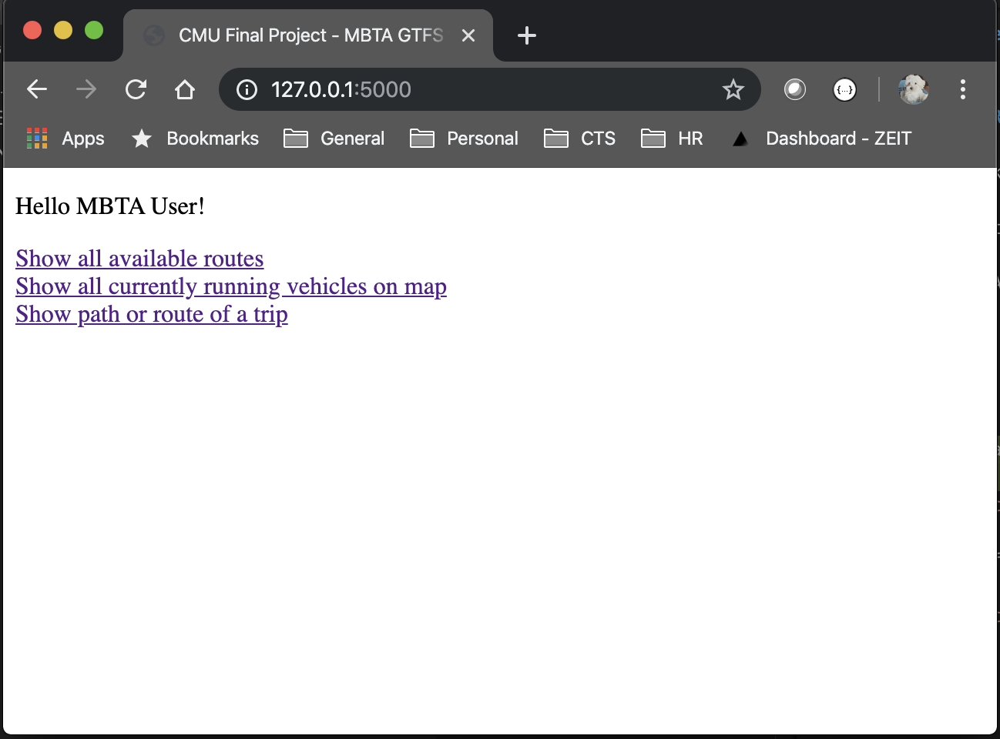
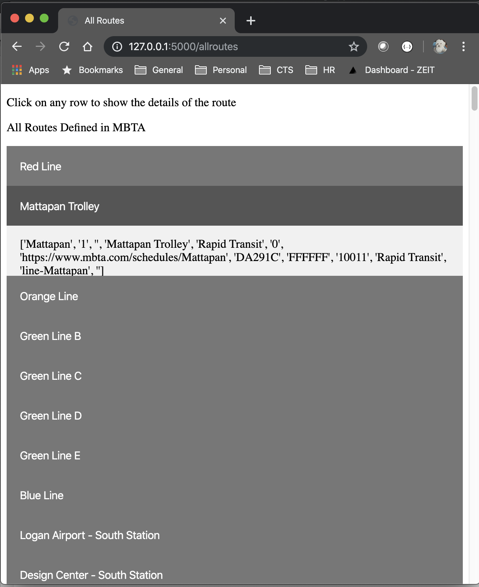
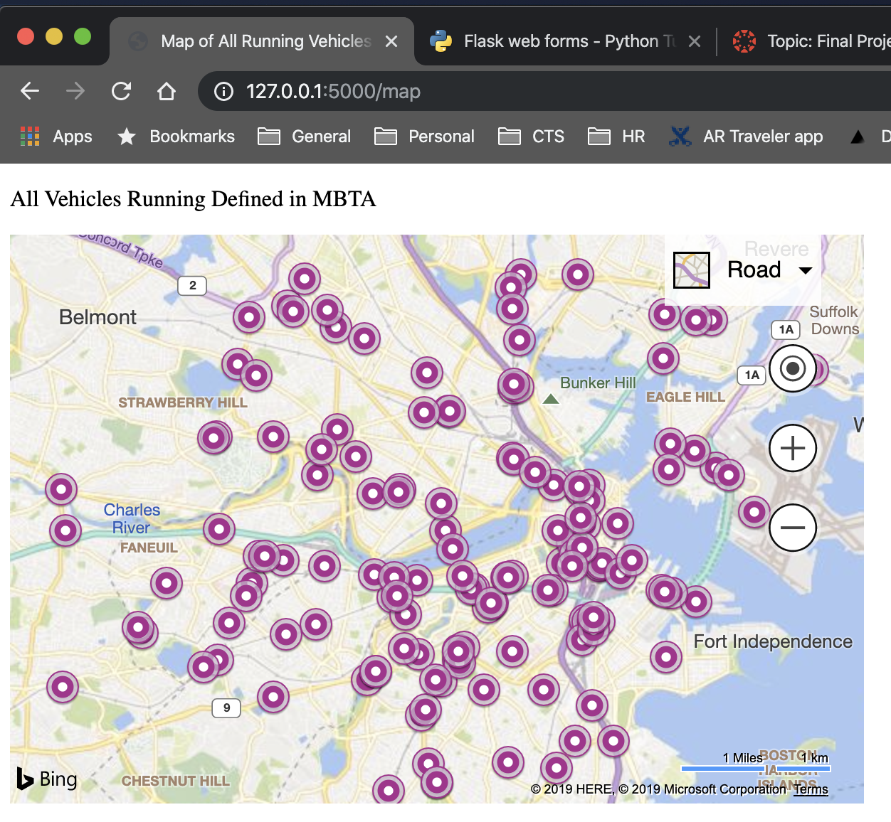
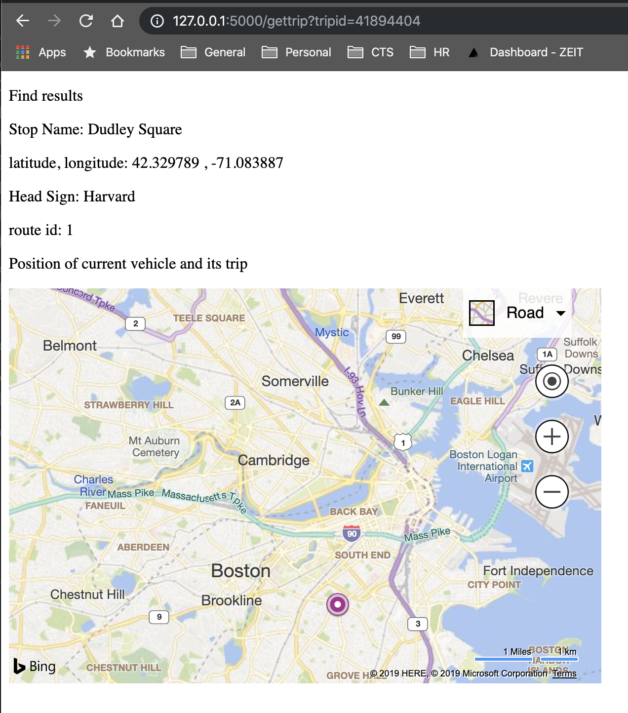

# Transit Tracker with GTFS 

## Introduction
This Python final project uses the primary Request and Flask external libraries to iterpret the transit bus and subway data for the Boston Metropolitan area managed by MBTA (Massachusetts Bay Transit Agency).  

Transit agencies such as MBTA uses a combination of static and real-time data to tell external users where their bus or subway vehicles are.  The format and data structure of the data is made available through one standard called GTFS, primarily led by Google.  

## Goals
The overall goal was to learn to use the flask and request libraries to learn and use the GTFS datasets which is described below.  

Including Flask and the Request, this also builds on the other concepts learned in the class such as object-oriented classes, reading CSV files, list comprehensions, sets, and dictionaries.

Also to build a web tool to determine the position and time of the current vehicles and to determine the path way that the vehicle was traveling along based on a schedule.

## What is GTFS
GTFS is the General Transit Feed Specification.  This the data format and data transmission specification used by many transit agencies such as MBTA to let external transit application developers such as Google to let them know the bus or train routes, trip and their travel patterns. 

The MBTA GTFS data comes from their web site.
https://www.mbta.com/developers/gtfs-realtime

GTFS has a reference web site
https://developers.google.com/transit/gtfs/reference

One of the clearest technical explanation of the GTFS specification.
https://multigtfs.readthedocs.io/en/latest/gtfs.html

## Requirements

 Requirement #1 to use a web interface for the user interface.

 Requirement #2 to display the vehicles on a visual map of the Boston area.

 Requirement #3 to interpret the GTFS data using the CSV file format.

 Requirement #4 to display some real-time vehicle data.

## Design 
The main program is built around using FLASK as the web framework.

From the webmain.py which is the main FLASK entry point, there are these helper class files:

routes.py  - a class to read the static data files.

readtimevehicles.py - a class to fetch the real time vehicle data from the MBTA web services and to do some data management for easier use.

There are many other py files as helper files to make the web pages easier to manage such as the tripdata.py and tripdropdownitem.py.  

The web template files are located in the subdirectory templates.  

And the static data files are located in GTFS-files.

## Limitations

This project goes into JavaScript, CSS, HTML, and the internal GTFS data formats that were more complicated than I had predicted.  Some of the easier complication such as CSS or JavaScript events were easier to resolve and implement into the solution.  But when there was some inconsistencies or un-understood data values in the real time data sets or the static files, then there was a lack of time to fully understand those concepts.

The future work is to better understand all the GTFS datasets and be able to predict or show accurate real time vehicle positions.

## Usage - How to Run 

./run-flask-web.sh

This script will execute the command line below to launch the python script to run its flask web server on port 5000 on http://127.0.0.1:5000/

    FLASK_APP=webmain.py flask run --reload

## Demo

When the main web site page opens

When the first link on the main page is clicked to show all known route, this is shown.

When one of the vehicles icon on the map is clicked a infobox is shown to present more details of the running vehicle.

There is a link inside the info box.  When that link is clicked, then that trip is shown on the map with some additional data about the trip.

